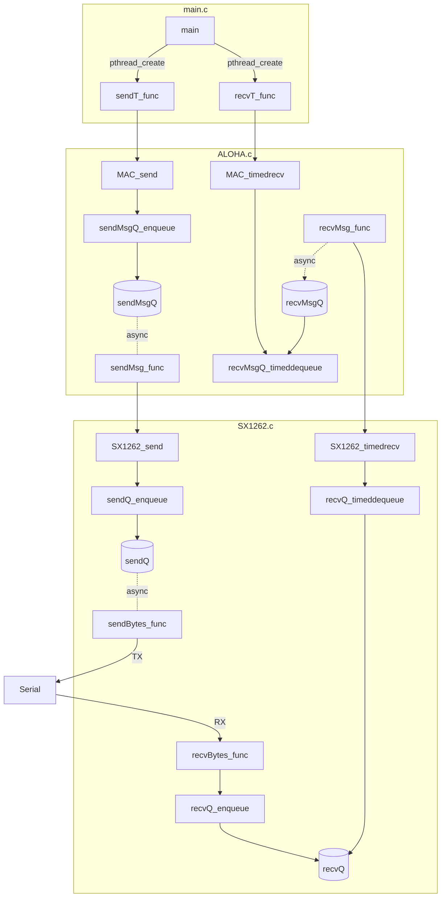
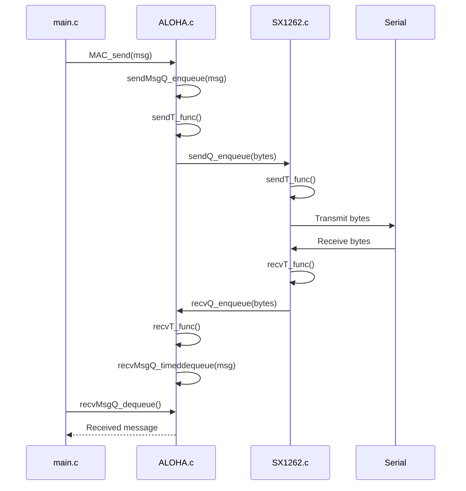
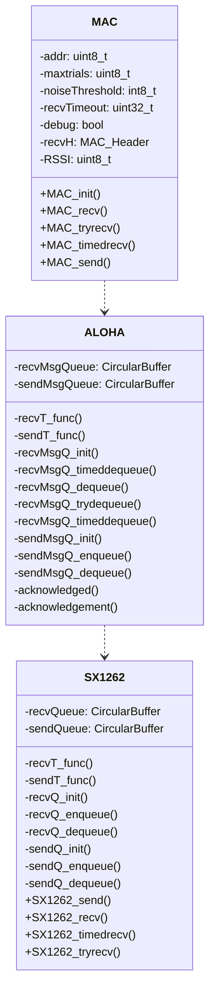
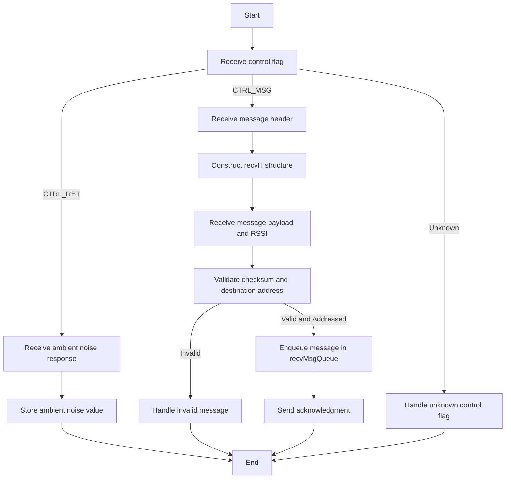
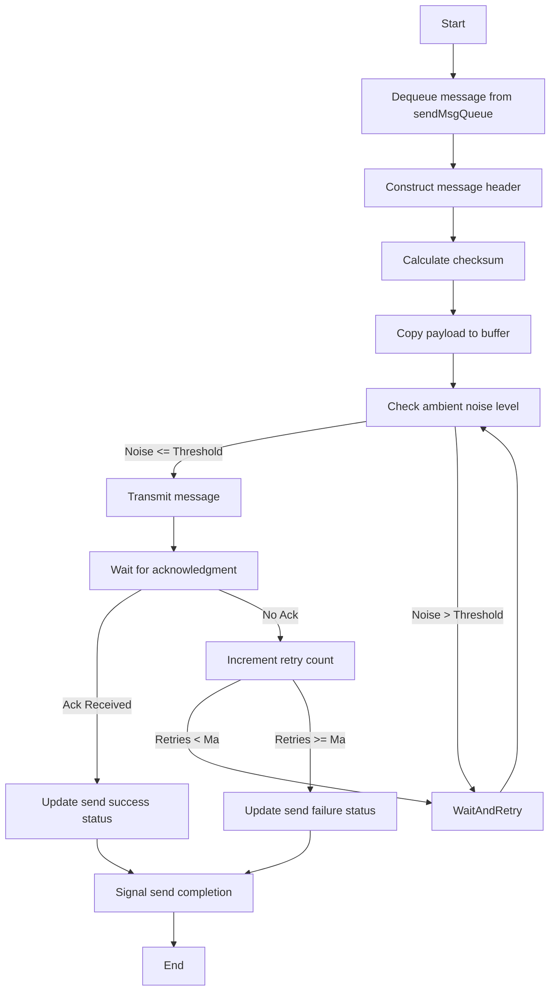
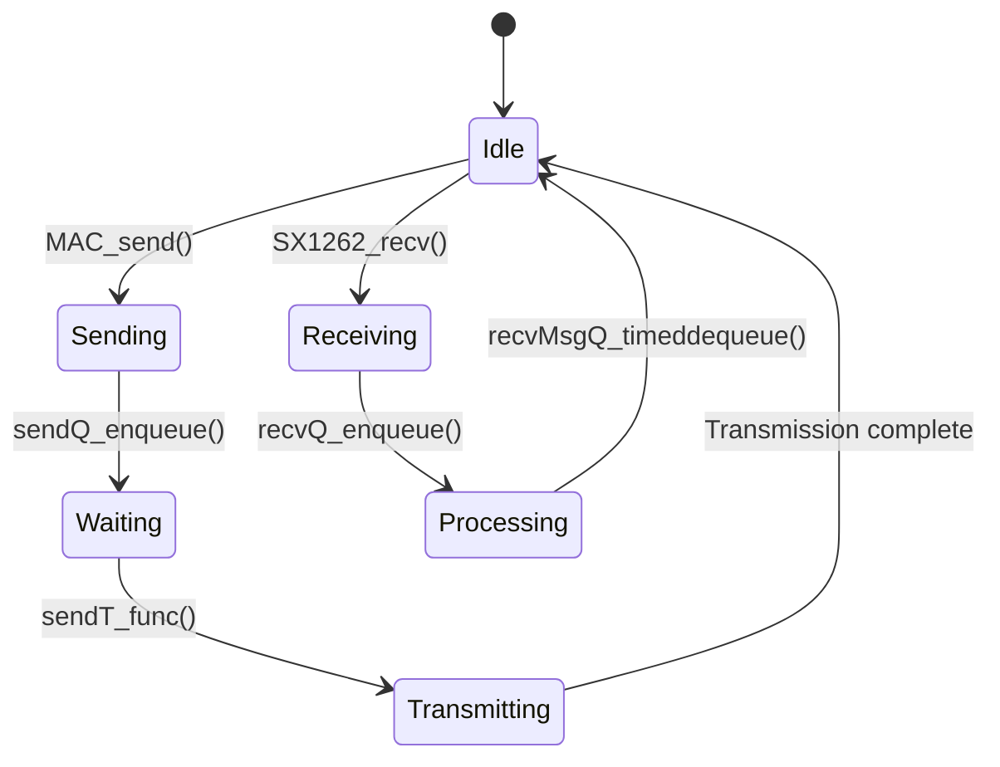

# wsn-testbed

## Overview

```mermaid
graph TD
    subgraph main.c
        main[main]
        send_t[sendT_func]
        recv_t[recvT_func]
    end

    subgraph ALOHA.c
        ALOHA_sendMsgQ_enqueue[sendMsgQ_enqueue]
        ALOHA_sendT_func[sendMsg_func]
        ALOHA_recvT_func[recvMsg_func]
        ALOHA_recvMsgQ_timeddequeue[recvMsgQ_timeddequeue]
        ALOHA_MAC_send[MAC_send]
        ALOHA_MAC_timedrecv[MAC_timedrecv]
        ALOHA_sendMsgQ[(sendMsgQ)]
        ALOHA_recvMsgQ[(recvMsgQ)]
    end

    subgraph SX1262.c
        SX1262_send[SX1262_send]
        SX1262_timedrecv[SX1262_timedrecv]
        SX1262_recvQ_timeddequeue[recvQ_timeddequeue]
        SX1262_sendQ_enqueue[sendQ_enqueue]
        SX1262_send_t[sendBytes_func]
        SX1262_recv_t[recvBytes_func]
        SX1262_recvQ_enqueue[recvQ_enqueue]
        SX1262_sendQ[("sendQ")]
        SX1262_recvQ[(recvQ)]
    end

    main-->|pthread_create| send_t
    main-->|pthread_create| recv_t
    send_t-->ALOHA_MAC_send
    -->ALOHA_sendMsgQ_enqueue
    -->ALOHA_sendMsgQ
    -.-|async|ALOHA_sendT_func
    --> SX1262_send
    -->SX1262_sendQ_enqueue
    -->SX1262_sendQ
    -.-|async|SX1262_send_t
    -->|TX| Serial

    Serial-->|RX|SX1262_recv_t
    -->SX1262_recvQ_enqueue
    -->SX1262_recvQ    

    recv_t-->ALOHA_MAC_timedrecv
    -->ALOHA_recvMsgQ_timeddequeue


    ALOHA_recvMsgQ-->ALOHA_recvMsgQ_timeddequeue
    ALOHA_recvT_func-->SX1262_timedrecv
    -->SX1262_recvQ_timeddequeue
    -->SX1262_recvQ

    ALOHA_recvT_func-.->|async|ALOHA_recvMsgQ

```

## Sequence Diagram 

```mermaid
sequenceDiagram
    participant main.c
    participant ALOHA.c
    participant SX1262.c

    main.c->>ALOHA.c: MAC_send(msg)
    ALOHA.c->>ALOHA.c: sendMsgQ_enqueue(msg)
    ALOHA.c->>ALOHA.c: sendT_func()
    ALOHA.c->>SX1262.c: sendQ_enqueue(bytes)
    SX1262.c->>SX1262.c: sendT_func()
    SX1262.c->>Serial: Transmit bytes

    Serial->>SX1262.c: Receive bytes
    SX1262.c->>SX1262.c: recvT_func()
    SX1262.c->>ALOHA.c: recvQ_enqueue(bytes)
    ALOHA.c->>ALOHA.c: recvT_func()
    ALOHA.c->>ALOHA.c: recvMsgQ_timeddequeue(msg)
    main.c->>ALOHA.c: recvMsgQ_dequeue()
    ALOHA.c-->>main.c: Received message

```

## Class Diagram

```mermaid
classDiagram
    class MAC {
        -addr: uint8_t
        -maxtrials: uint8_t
        -noiseThreshold: int8_t
        -recvTimeout: uint32_t
        -debug: bool
        -recvH: MAC_Header
        -RSSI: uint8_t
        +MAC_init()
        +MAC_recv()
        +MAC_tryrecv()
        +MAC_timedrecv()
        +MAC_send()
    }

    class ALOHA {
        -recvMsgQueue: CircularBuffer<recvMessage>
        -sendMsgQueue: CircularBuffer<sendMessage>
        -recvT_func()
        -sendT_func()
        -recvMsgQ_init()
        -recvMsgQ_timeddequeue()
        -recvMsgQ_dequeue()
        -recvMsgQ_trydequeue()
        -recvMsgQ_timeddequeue()
        -sendMsgQ_init()
        -sendMsgQ_enqueue()
        -sendMsgQ_dequeue()
        -acknowledged()
        -acknowledgement()
    }

    class SX1262 {
        -recvQueue: CircularBuffer<uint8_t>
        -sendQueue: CircularBuffer<Bytes>
        -recvT_func()
        -sendT_func()
        -recvQ_init()
        -recvQ_enqueue()
        -recvQ_dequeue()
        -sendQ_init()
        -sendQ_enqueue()
        -sendQ_dequeue()
        +SX1262_send()
        +SX1262_recv()
        +SX1262_timedrecv()
        +SX1262_tryrecv()
    }

    MAC ..> ALOHA
    ALOHA ..> SX1262


```
## Activity Diagrams
### Receive

```mermaid
graph TD
    Start-->ReceiveControlFlag[Receive control flag]
    ReceiveControlFlag--CTRL_RET-->ReceiveAmbientNoise[Receive ambient noise response]
    ReceiveAmbientNoise-->StoreAmbientNoise[Store ambient noise value]
    StoreAmbientNoise-->End
    ReceiveControlFlag--CTRL_MSG-->ReceiveHeader[Receive message header]
    ReceiveHeader-->ConstructRecvH[Construct recvH structure]
    ConstructRecvH-->ReceivePayload[Receive message payload and RSSI]
    ReceivePayload-->ValidateMessage[Validate checksum and destination address]
    ValidateMessage--Invalid-->HandleInvalidMessage[Handle invalid message]
    HandleInvalidMessage-->End
    ValidateMessage--Valid and Addressed-->EnqueueMessage[Enqueue message in recvMsgQueue]
    EnqueueMessage-->SendAck[Send acknowledgment]
    SendAck-->End
    ReceiveControlFlag--Unknown-->HandleUnknownFlag[Handle unknown control flag]
    HandleUnknownFlag-->End

```
### Send

```mermaid
graph TD
    Start-->DequeueMessage[Dequeue message from sendMsgQueue]
    DequeueMessage-->ConstructHeader[Construct message header]
    ConstructHeader-->CalculateChecksum[Calculate checksum]
    CalculateChecksum-->CopyPayload[Copy payload to buffer]
    CopyPayload-->CheckAmbientNoise[Check ambient noise level]
    CheckAmbientNoise--Noise <= Threshold-->TransmitMessage[Transmit message]
    TransmitMessage-->WaitForAck[Wait for acknowledgment]
    WaitForAck--Ack Received-->UpdateSendSuccess[Update send success status]
    UpdateSendSuccess-->SignalCompletion[Signal send completion]
    WaitForAck--No Ack-->IncrementRetries[Increment retry count]
    IncrementRetries--Retries < Max-->WaitAndRetry
    WaitAndRetry-->CheckAmbientNoise
    CheckAmbientNoise--Noise > Threshold-->WaitAndRetry
    IncrementRetries--Retries >= Max-->UpdateSendFailure[Update send failure status]
    UpdateSendFailure-->SignalCompletion
    SignalCompletion-->End


```

## State Diagram

```mermaid
stateDiagram-v2
    [*] --> Idle
    Idle --> Sending: MAC_send()
    Sending --> Waiting: sendQ_enqueue()
    Waiting --> Transmitting: sendT_func()
    Transmitting --> Idle: Transmission complete
    Idle --> Receiving: SX1262_recv()
    Receiving --> Processing: recvQ_enqueue()
    Processing --> Idle: recvMsgQ_timeddequeue()
```
